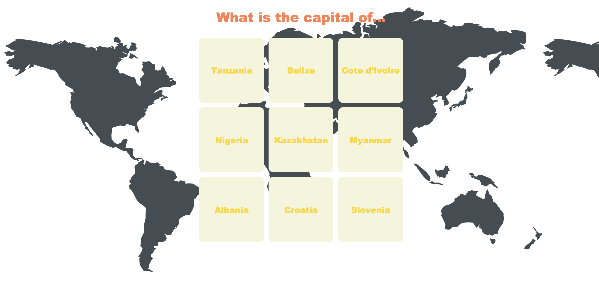

# Flashcards

 <b>Objective:</b> Create a simple, stylized page with flashcards; each containing a question on one side and the answer on the other. 
Further, the cards must flip to the other side whenever the mouse is over them. You can try this out by cloning the repository, opening the file and putting the mouse over any of the cards.
 <b>Programming Language:</b> HTML, CSS

## Files
<ul>
  <li> <a href="./src/index.html">index.html</a> --> HTML file.
  <li> <a href="./src/style.css">style.css</a> --> stylesheet containing the styles applied to index.html.
  <li> <a href="./src/world.png">world.png</a> --> Picture used as background image for the website.
  <li> <a href="./Screenshot.png">Screenshot.png</a> --> Picture depicting the end result.
</ul>

## Screenshot

  
   
  Index.html file with the applied style.

## Authors

* **Pablo Miró** - [Paramiru](https://github.com/Paramiru)

